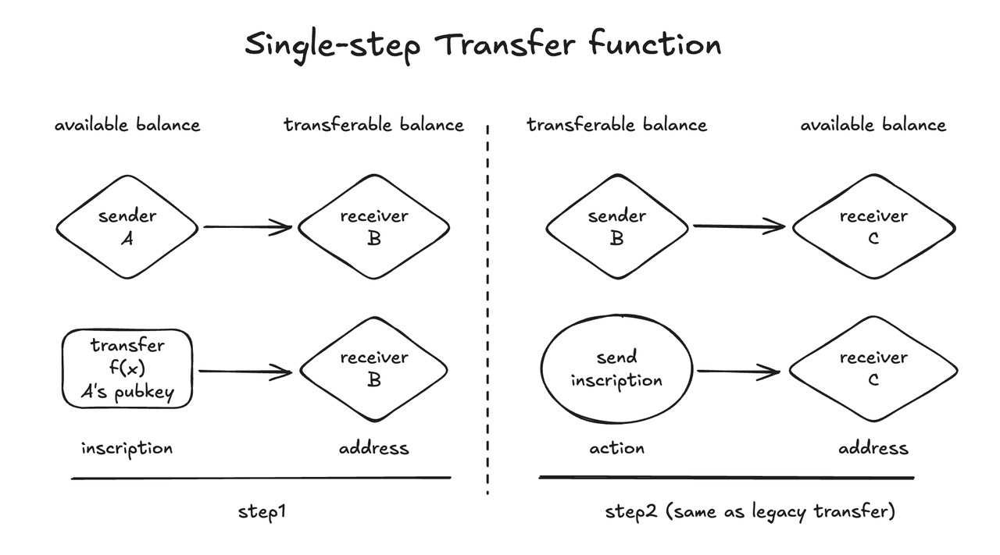

# BRC20单步transfer和相关改动提案 v2

### 动机

由于历史原因, brc20还不支持vindicated铭文, 这给brc20相关工具造成了不便. 由于大部分ordinals生态已不再关心vindicated铭文的区别, 而且通用的bitcoin工具默认创建的铭文格式是vindicated的. 是时候适当让brc20也支持vindicated铭文了.

在bitcoin网络中的铭文里, brc20的transfer铭文和mint铭文是绝对的大多数. 而这些绝对的大多数铭文在brc20协议层面是一次性使用的. 用户的地址上可能存在大量的这种废弃铭文, 给正常使用造成了不便. 我们建议在mint和transfer铭文中支持“to”字段来指定接收方, 并且直接铸造unbound铭文来尽可能彻底和低成本排除这些铭文的后续影响. 这也要求brc20支持vindicated铭文.

在brc20协议中transfer过程中会产生3笔链上交易, 为了降低转账成本和优化用户体验, 我们设计了单步转账的方法.

我们希望在3个方面对brc20使用体验有所改进：
1. 通过在铸造时支持vindicated铭文, 降低铸造要求
2. 通过直接解除铭文绑定来降低铭文对用户的干扰
3. 通过减少交易步骤来降低转账成本


### Vindicated铭文支持

brc20铭文不接受Cursed铭文和Vindicate铭文。我们建议基本放开这个规则，即deploy/mint/transfer铭文包括单步transfer铭文都允许Vindicate铭文。但除单步transfer外其他铭文(mint/deploy/legacy-transfer)不支持单笔交易内的多次铸造.


### 单步transfer机制

在铸造任何铭文的交易脚本中几乎总会附带一个公钥，并且要求签名，主要目的是防止其他人替换铸造交易。如下：

```
OP_PUSHBYTES_32 9e2849b90a2353691fccedd467215c88eec89a5d0dcf468e6cf37abed344d746
OP_CHECKSIG
OP_FALSE
OP_IF
OP_PUSHBYTES_3 6f7264
...
OP_ENDIF
```

这个在taproot脚本分支中的公钥签名校验是一种标准的schnorr签名，我们可以简单复用这个机制，把这个公钥对应的地址作为铸造brc20 transfer时锁定的可用余额来源，就能有效避免无授权的transfer铸造。
在legacy transfer中，锁定的transferable余额属于铭文的持有地址，这个地址同时也是可用余额的来源地址。但在公钥已经可以指定余额来源地址而不需要通过铭文持有地址的情况下，铭文持有地址就可以作为新的接收地址，这产生了一种在铸造时就单步转移余额的新方式。如下图所示：




### 对于mint和单步transfer支持to字段

在brc20早期版本中, transfer是有to字段设计的, 但因为和铭文实际接收地址重复而没有被协议使用. 

为了降低成本和排除废弃铭文对用户的干扰. 在mint和带有明确签名方的单步transfer是合适使用to字段来指定接收地址的.

当mint带有to字段时, 不再以铭文接收地址作为余额接收方, 这时可以用unbound铭文完全排除铭文对任何地址的影响.

当单步transfer铭文带有to字段时, 单步transfer的行为变得和mint类似, 将一次性将签名方的可用余额转移到to字段地址的可用余额, 铭文即失效, 而无论这个铭文被发送到什么地址. 这时可以用unbound铭文完全排除铭文对任何地址的影响.

注意deploy铭文似乎不需要增加to字段.


### 单步transfer中的公钥签名和对应的地址

Ordinals协议并不要求铭文是否包含公钥和签名，由于常见的 `OP_PUSHBYTES_32 + OP_CHECKSIG` 所附带的公钥签名可以失败，可以被绕过从而伪造任何公钥，我们需要使用更为严格的 `OP_CHECKSIGVERIFY` 来校验签名。同时需要明确指定公钥对应的地址类型。参考bitcoin的3种主流地址在ScriptPK中都使用单字节前缀的方法区分地址类型，我们也用单字节来描述几种可以从公钥转换的8种地址类型。
我们定义单步transfer铭文脚本必须以 `OP_PUSHBYTES_32 + OP_CHECKSIGVERIFY + OP_N` 格式开头。其中N指代地址类型：

1. P2TR 空脚本路径
2. P2WPKH 压缩偶数公钥
3. P2WPKH 压缩奇数公钥
4. P2PKH 压缩偶数公钥
5. P2PKH 压缩奇数公钥 
6. P2SH-P2WPKH： Nested SegWit 压缩偶数公钥
7. P2SH-P2WPKH： Nested SegWit 压缩奇数公钥
8. P2TR 密钥路径

比如最简单的空脚本路径的taproot地址，脚本格式如下：

```
OP_PUSHBYTES_32 9e2849b90a2353691fccedd467215c88eec89a5d0dcf468e6cf37abed344d746
OP_CHECKSIGVERIFY
OP_1
OP_FALSE
OP_IF
...
OP_ENDIF
```

Inscriptions that do not belong to these 8 standard formats are not single-step transfer inscriptions.

注意deploy/mint铭文并不需要支持这种签名机制.

### 升级激活

We can first enable single-step transfer on 5 characters, then enable it in 4-character brc20. This is much safer. And when we need to enable 4 characters, the workload is very small.


### 致谢

感谢domo在确定单步transfer方案过程中提出了许多改进反馈意见，感谢seesharp指出需要处理铭文utxo膨胀的思路。

### Indexer规则

这里列出索引规则

- 如果将不带“to”字段的单步transfer直接铸造到op_return,则视为burn
- 如果将不带“to”字段的单步transfer直接铸造到module的接收地址,则支持充值到module
- Module 的withdraw将忽略单步方式的签名
- deploy/mint铭文将忽略单步方式的签名
- 单步transfer支持批量铸造（直接支持vendicate）
- mint支持vendicate但不支持单笔交易内的多次mint（多次mint的第一次是合法的，仅通过铭文id的i0来过滤）
- deploy也正常支持vendicate，但不支持单笔交易内多次deploy（多次deploy的第一次是合法的，仅通过铭文id的i0来判断）
- 暂时不区分地址是否使用过单步transfer，legacy transfer照常支持使用
- mint支持在铭文json中加“to”来指定目标地址
- 支持在单步transfer铭文json中加“to”字段来指定目标地址, 这时单步铭文将像mint一样铸造后即作废, 无论铸造到什么接收地址, 建议铸造unbound铭文或铸造到opreturn销毁.
- 如果“to”字段不是合法的地址, 则视为销毁. “to”字段如果不是字符串类型或“to”字段为空则视为不带“to”字段.
- 带“to”字段的单步transfer直接铸造到module接收地址, 不会充值到module, “to”字段优先生效.
- 不带“to”字段的单步transfer如果被铸造到和signer地址不同的其他地址, 则将转移余额, 并作废.(已在fb实施)
- 不带“to”字段的单步transfer如果被铸造到和signer地址相同的地址,则像传统transfer铭文一样, 支持通过发送铭文来转移余额.(单步transfer的基本规则, 在这里作为强调)
